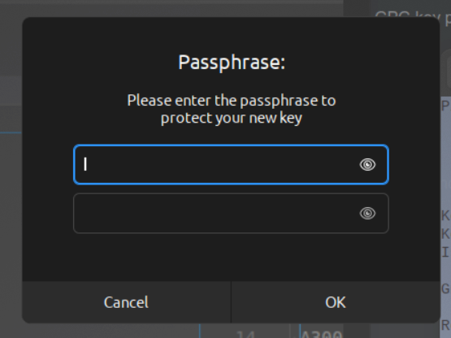
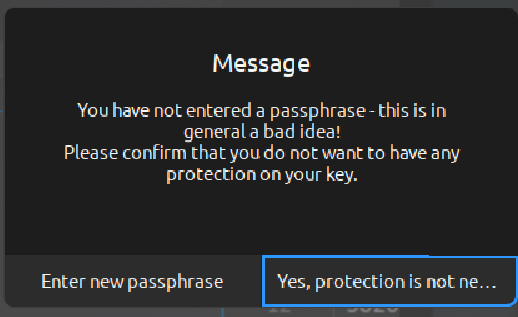

## Generating a new GPG key on ubuntu

* Install required tools

```bash
# ubuntu
sudo apt-get install gpa
```

* Generate a GPG key pair by running the below command

```bash
# ubuntu
gpg --full-generate-key
```

```bash
gpg (GnuPG) 2.2.27; Copyright (C) 2021 Free Software Foundation, Inc.
This is free software: you are free to change and redistribute it.
There is NO WARRANTY, to the extent permitted by law.

Please select what kind of key you want:
   (1) RSA and RSA (default)
   (2) DSA and Elgamal
   (3) DSA (sign only)
   (4) RSA (sign only)
  (14) Existing key from card
Your selection? 
```
* now after this command we have to select kind of key we want. Input the number from the list or press Enter to select default
```bash
RSA keys may be between 1024 and 4096 bits long.
What keysize do you want? (3072) 
```
* now type the bits long or press enter to accept default 3072 bits. Remember longer bits long is batter.

```bash
Please specify how long the key should be valid.
         0 = key does not expire
      <n>  = key expires in n days
      <n>w = key expires in n weeks
      <n>m = key expires in n months
      <n>y = key expires in n years
Key is valid for? (0) 

```
* in this step specify how long the key should be valid or press enter to accept 0 wich means it will not expire.

```bash
Is this correct? (y/N) 
```
* If you are happy with your configeration press `Y` to continue

```bash
GnuPG needs to construct a user ID to identify your key.

Real name:
```
* now provied your name that the key will use let set `example` as the name

```bash
Email address: 
```
* now provied a valid Email adrees, let set `example@gmail.com` as the email. Oomthing to remember if you want to use this with your github use the same email that github was crete with.
```bash
comment: 
```
* add a massage or short word yu like.
```bash
You selected this USER-ID:
    "example (gpg-key) <example@gmail.com>"

Change (N)ame, (C)omment, (E)mail or (O)kay/(Q)uit? 
```
* in this step you can edit your name by pressing `N` ,comment by presing `C `And `E` for email. quit by presing `Q` . To continue creating key press `O` to create **Passphrase** whis will be like a Password

<br /><br />

* here if  you want to  a create passphrase . type your Password on both of the field and prees `OK`. your key wll be generated ,
* on the other hand, if you dont want any Password/passphrase just prees `OK` with out putting any thing in the field . at this step it will show a massage saying `you have not enter passphrase...` . mow select the option saying `Yes, potation not needed` remember you have to select the option **twice**

<br /><br />

* now your Key generation is complete
```bash
We need to generate a lot of random bytes. It is a good idea to perform
some other action (type on the keyboard, move the mouse, utilize the
disks) during the prime generation; this gives the random number
generator a better chance to gain enough entropy.
We need to generate a lot of random bytes. It is a good idea to perform
some other action (type on the keyboard, move the mouse, utilize the
disks) during the prime generation; this gives the random number
generator a better chance to gain enough entropy.
gpg: key 0D6FB2D4EA4[][]09 marked as ultimately trusted
gpg: revocation certificate stored as '/home/[user-name]/.gnupg/openpgp-revocs.d/187[][]38DCF51620C688FF880D6FB2D4EA4[][]A09.rev'
public and secret key created and signed.

pub   rsa3072 2024-07-09 [SC]
      187[][]38DCF51620C688FF880D6FB2D4EA4[][]A09
uid                      examole (GPG-key) <example@gmail.com>
sub   rsa3072 2024-07-09 [E]
```

* to check you keys thpe this command 
```bash
gpg --list-secret-keys --keyid-format=long
```
- output
```bash
sec   rsa3072/0D6FB2D4EA477A09 2024-07-09 [SC]
      187BE138DCF51620C688FF880D6FB2D4EA477A09
uid                 [ultimate] examole (GPG-key) <example@gmail.com>
ssb   rsa3072/0F1ADC9010271E26 2024-07-09 [E]

```

<p align="center">
 ----- end -----
</p>